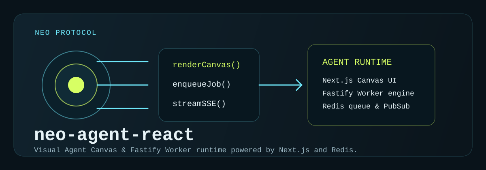

# NEO Agent React
<!-- markdownlint-disable MD003 MD007 MD013 MD022 MD023 MD025 MD029 MD032 MD033 MD034 -->

```text
========================================
      NEO-AGENT-REACT · RUNTIME
========================================
Status: ACTIVE
Mode: DISTRIBUTED SERVICES
Package Manager: pnpm@11.7.0
========================================
```

## ⟠ Objetivo

`neo-agent-react` implementa runtime de agentes NEO
com canvas visual em Next.js,
estado reativo via Zustand,
e execução distribuída via worker + Redis.

────────────────────────────────────────

## ⧉ Estrutura

```text
neo-agent-react/
├── apps/
│   └── canvas-ui/          # Next.js + React Flow + SSE bridge
├── packages/
│   └── engine/             # Worker core, schemas, runner, skills
├── services/
│   └── worker/             # API/runner HTTP do worker
├── docker-compose.yml      # stack local separada
├── Makefile                # comandos operacionais
└── RAILWAY_DEPLOY.md       # contrato de deploy Railway
```

────────────────────────────────────────

## ⨷ Execução Local

```bash
make bootstrap
make docker-up
```

Serviços padrão:

- UI: `http://localhost:3000`
- Worker API: `http://localhost:4001`
- Redis: `redis://localhost:6379`

Modo híbrido:

```bash
make infra-up
make ui
make worker-api
```

────────────────────────────────────────

## ◬ Contrato de Runtime

- UI e worker são serviços independentes.
- Integração entre serviços ocorre por:
  - Redis Pub/Sub
  - HTTP (`WORKER_BASE_URL`)
- Não há compartilhamento de arquivos
  entre serviços em produção.

────────────────────────────────────────

## ⍟ Deploy

Use `RAILWAY_DEPLOY.md` como fonte operacional.

Ele define:

- comandos por serviço,
- variáveis obrigatórias,
- e estratégia segura para workspace `pnpm`
  com `services/worker` consumindo `packages/engine`.
